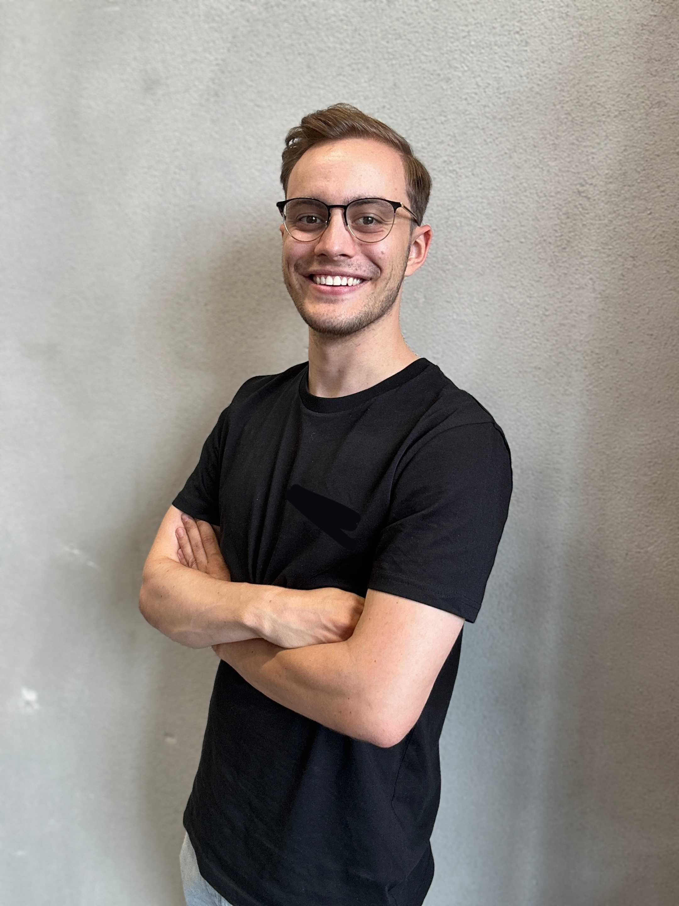

# **Presenting myself**

My name is Finn Rasmus Schäfer. I am currently aiming for my Masters degree in Robotics, Cognition and Intelligence at Technical University of Munich. Beside my studies i am Working Student at BMW in the field of Computer Vision (with specialization on Lidar development for high automated driving). Beside my studies i took part in Formula Student Driverless and the Indy Autonomous Challenge. 

# Finn Rasmus Schäfer
## *Software Engineer*

## Contact Information
- **Email:** finnrasmus2000@gmail.com
- **LinkedIn:** [linkedin.com/in/finnschaefer](www.linkedin.com/in/finn-rasmus-schaefer-abaa4820b)
- **GitHub:** [github.com/finnschaefer1901](https://github.com/finnschaefer1901)

## Summary
My Name is Finn Rasmus Schäfer, I am a german software engineer with interests in automotive, computer vision and 3D Machine Learning. I studied electrical engineering with focus on automation in cooporation with the Deutsche Bahn Netz Ag. I was active in Formula Student Driverless, the Indy autonomous challenge. My Work experience can be derived from the following sections:

## Work Experience
### Cooperate Student at DB Netz Ag (Sep. 2018 - Oct. 2022)
- Testing
- Validation
- Development
- Commissioning
- Railway Engineering

### Working Student at DeepDrive (Nov. 2022 - Aug. 2023)
- Automation
- Safety
- CANApe
- Testbench setup
- Electric Motor

### Working Student at BMW Ag (Sep. 2023 - Present)
- Sensor Data Analysis
- Visualization
- ADAS
- Autonomous Driving

## Education
### Bachelor of Engineering in Railway Engineering
**Technical University Mittel Hessen** (2018-2019)
- Railway Engineering
- Safety & Regulations

### Bachelor of Engineering in Electical Engineering - Automation
**Cooperate State University Mannheim** (2019 - 2022)
- Control Theory
- Automation
- Information Technology

### Master of Science in Robotics Cognition and Intelligence
**Technical University of Munich** (2022-2024)
- Deep Learning
- Robotics
- Computer Vision
- Machine Learning

## Skills
- Programming Languages: Python, C, C++
- Databases: MySQL, PSQL
- Version Control: Git
- Project Management: Jira, GitHub
- Problem Solving
- Team Collaboration

## Scientific Publications
**Signal processing pipeline for an autonomous electrical race car** [Signalverarbeitungsforum Karlsruhe 2022](https://publikationen.bibliothek.kit.edu/1000150865/149629985)

## Projects
### Formula Student Driverless
- curvature optimal Motion Planning
- Trajectory planning
- linear Model Predictive Control

### Indy Autonomous Challenge
- Visualization
- Data analysis
- time optimal planning

### Practical Course in 3D Scanning and Spatial Learning
- Our Team investigated the VOCA apprach 
- speech driven Face animation
- intuitive emotions

### Seminar on 3D Machine Learning
- Learning on Point Cloud Data
- Dynamic Graph CNNs
- EdgeConv

## Languages
- English
- German
- French (basic communication)

## Interests
Autonomous Driving, Machine Learning and Artificial Intelligence, Automation, Football, Travelling

