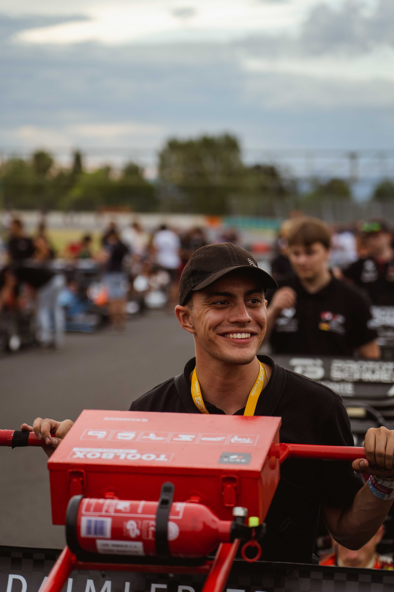
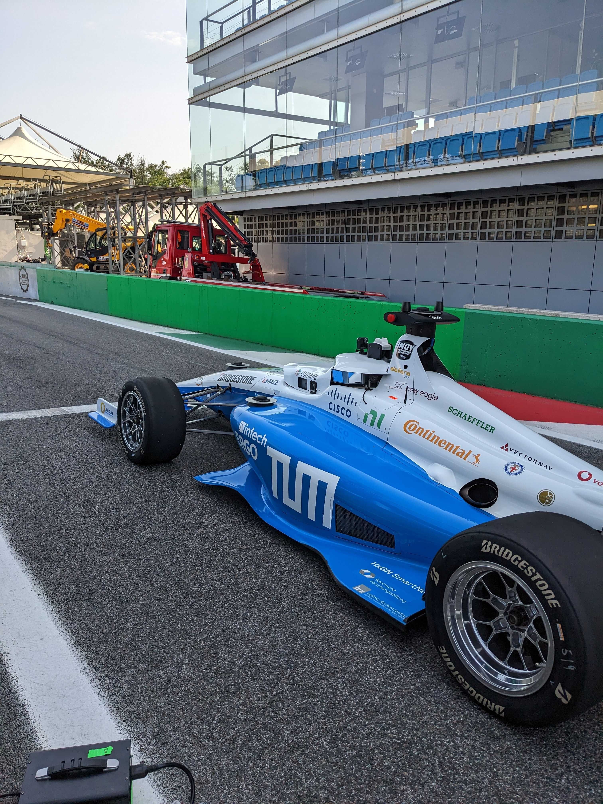

# **Project**

On this page, all my projects are documented. This is not related to the [papers, thesis and Documentation](https://finnschaefer1901.github.io/pub/Publications); this is focused on the practical work.

## Cooperative Study
During my studies at DHBW Mannheim in cooperation with Deutsche Bahn Netz AG, I undertook various practical projects. Most of these projects in this field revolved around testing and validation. I participated in ultrasonic testing of ICE Trains, established the documentation system for a test laboratory, and contributed to a variety of tests for digital switch systems. In each practical phase, I was required to compose a scientific report detailing the current state of the art, foundational work, my own contributions, and potential future approaches.
Due to the IP of the topics discussed, which belong to DB Netz AG Zentrale, I am unable to publicly share these reports.

## Formula Student

### What is Formula Student (Driverless)
Formula Student is an international engineering championship where a variety of universities compete against each other. The primary objective is to design and construct a race car capable of competing against other universities in events held throughout the season. These events consist of both static and dynamic disciplines. The static events focus on knowledge presentation, covering not only technical aspects but also business-related topics. On the other hand, the dynamic disciplines involve racing, testing aspects such as lateral and longitudinal vehicle dynamics, as well as battery performance across various challenges. For further details, please consult this source [here](https://www.formulastudent.de/about/concept/).

### What did I do?
As a member of the Formula Student Driverless team, I was a part of [CURE Mannheim](https://curemannheim.de/). My primary responsibilities included developing a motion planning approach for our autonomous race car. I also contributed to the field of Model Predictive Control and served as the static lead of our autonomous subteam. We developed our own curvature-optimal planner, and you can find the basic concept and graphical explanations [here](https://finnschaefer1901.github.io/pub/Publications). Upon completing my active season and my bachelor's degree, I remained involved with the team, providing feedback on designs and implementations. I also guide current team members through their study theses.

## Indy Autonomous Challenge

### Monza Challenge 2023
The 2023 Monza Challenge was the inaugural Autonomous Road Course Competition of the Indy Autonomous Challenge, which had its first edition in October 2021 in Indianapolis. The objective of the Monza Challenge was to conduct timed racing laps for the first time on the Monza Formula 1 Track. The central concept involved providing each team with the same car, the ([Dallara AV-21](https://www.indyautonomouschallenge.com/racecar)). The Dallara AV-21 is a standard Indy Car that has been outfitted with a sensor stack to enable full autonomous operation. As of August 2023, one of these cars currently holds the world record for the [fastest autonomous race car](https://www.youtube.com/watch?v=kzj49NLTlcY). The 2023 Monza Challenge was organized as a race without overtaking (with overtaking most likely planned for Monza 2024).

### What I did at TUM Autonomous Motorsport
As a team member of TUM Autonomous Motor Sport, I participated as a planning team member in the 2023 Monza Challenge. My responsibility involved visualizing captured data and re-implementing a debugging tool for our new [local](https://scholar.google.com/citations?view_op=view_citation&hl=en&user=R4wwim0AAAAJ&citation_for_view=R4wwim0AAAAJ:u-x6o8ySG0sC) and [global](https://arxiv.org/abs/2304.10954) planner approach.

## Practical Course om 3D Scanning and Spatial Learning
As part of my studies I participated in a Practical Course with focus on 3D Scanning and Spatial Learning. My team and I had the task to perform intuitive, speech-driven face animation. Our Team split up in two groups, one choosing a learning-based transformer approach and focusing on blendshapes. For a neural network it is quite hard to learn the correlation between speech input and realistic (emotional) Face animation. Our Subteam concentrated on improving on the Voice operated character animation ([VOCA](https://voca.is.tue.mpg.de/)). This approach delivers a good generalization result on lip movement but struggles harldy with expressing emotions. The features extracted out of the input audio (using deepspeach) are extracted to a one-hat encoding vector that should be able to display different speeking styles. These speaking styles do not deliver emotional face movement. Our KISS approach was to extract the Emotion out of the audio input and then merge the voca output with a specific emotion template. This leads to a reasonable result. By comparing the results we could definetly say that the transformer approach works significantly better when it comes to intutive generalization. The approaches both leaked a bit to robustness.
<video width="100%" height="auto" controls>
  <source src="../assets/img/blendshape.mp4" type="video/mp4">
  Your browser does not support the video tag.
</video>

We also had some experiements with re-training voca on the [RAVDESS Dataset](https://zenodo.org/record/1188976). The main challenge was to transfer the original RAVDESS data into usable training data for the VOCA model. When using this training approach we got more resonable results in context of face movement but we weren't able to get a result as clean as the original VOCA result is. 
<video width="100%" height="auto" controls>
  <source src="../assets/img/happy_ravdess.mp4" type="video/mp4">
  Your browser does not support the video tag.
</video>

### Seminar on 3D Machine Learning
Within this Seminar we discussed state of the art papers in the field of 3D Machine Learning. As I am highly interested in LIDAR sensors and Point Cloud Data, I choosed to present the ["Dynamic Graph CNN for Learning on Point Clouds"](https://arxiv.org/abs/1801.07829) Paper that expanded the PointNet and PointNet++ approach by introducing EdgeConv. A detailed Summary and Comparison can be found [here](../assets/doc/Seminar_Schaefer_FinnRasmus_final.pdf).

## Private
My personal projects primarily involve data capture initiatives. Currently, I am in the process of developing a PCB using KiCAD that records various physical parameters from a standard car. The primary objective is to attain the capability to gauge the vehicle's dynamic performance and to establish a live telemetry system for it. This pursuit is largely driven by my fascination with automobiles and a general interest in performance measurement. 